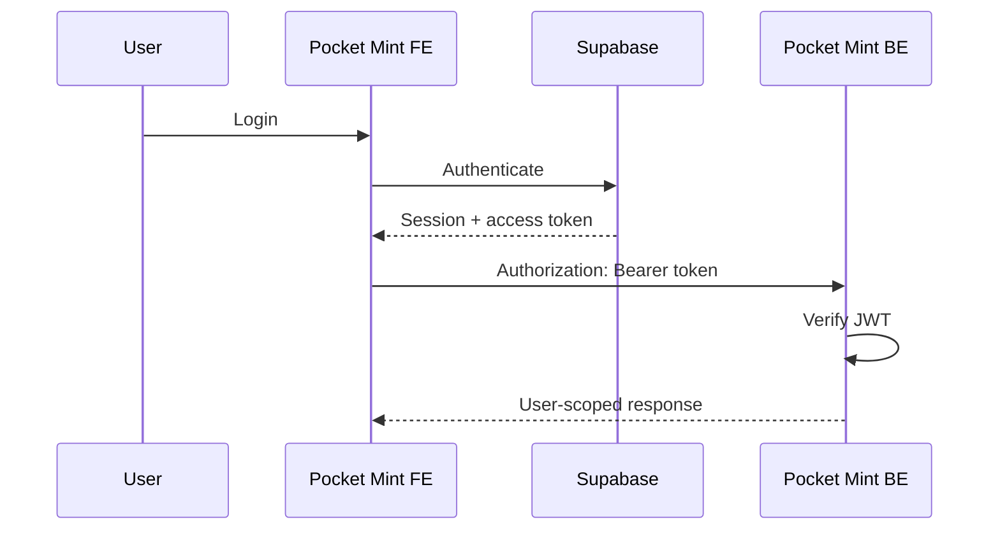

# Frontend Authentication — Supabase Bearer JWT

The backend (`pocket-mint-be`) is **JWT-only**. Every protected request must carry:

```http
Authorization: Bearer <supabase-access-token>
```

The backend verifies the token signature, issuer, audience, and expiry, and derives
the user **exclusively** from the verified `sub` claim. The frontend no longer sends
`x-api-key`, `x-user-id`, or `x-user-email`, and there is **no backend API key**.

## Flow



## Access-token attachment

- **Source of truth:** the active Supabase session. The token is read fresh on
  every request — never cached at module scope — via
  `supabase.auth.getSession().data.session.access_token`.
- **Client requests:** `lib/api.ts` (single axios instance) attaches the token in a
  request interceptor ([`authRequestInterceptor`](../lib/api.ts)). All feature hooks
  (`useWallets`, `useTransactions`, `useInstallments`, `useSparkline`) go through it.
- **Server requests:** `/users/sync` ([`lib/auth/sync-user.ts`](../lib/auth/sync-user.ts))
  is called from server actions / the OAuth callback and passes the session's
  `access_token` explicitly (server client, request cookies — no browser globals).

### Request classification

`lib/api.ts` requests default to `authMode: "required"`. Public endpoints (none exist
today) would opt out with `authMode: "none"`. There is no ambiguous `skipAuth` flag.
A protected request with no session **throws before leaving the browser**
(`AuthenticationRequiredError`) rather than hitting the backend unauthenticated.

## Session refresh

Supabase maintains and refreshes the session; the middleware ([`proxy.ts`](../proxy.ts)
→ `updateSession`) calls `getUser()` to keep SSR cookies fresh. Because the client
reads the session immediately before each request, a refreshed token is used
automatically. No custom refresh-token storage exists, and refresh tokens are never
sent to the backend.

## 401 handling

Centralized in `lib/api.ts` ([`unauthorizedResponseInterceptor`](../lib/api.ts)):

1. Non-401 errors pass through unchanged (backend error envelope preserved).
2. On 401, read the current session token. If it is **newer** than the token that was
   rejected (i.e. Supabase refreshed it), retry the request **once**. A 401 means the
   backend rejected the request before acting on it, so this is safe even for
   mutations. See `shouldRetryWithFreshToken`.
3. Same-token 401 (or already retried) → clear local auth state (`signOut`) and
   redirect to `/login`. No retry loop; JWT verification details are never shown.

## `/users/sync` sequence

Sends **only** `{ name }` with the Bearer token. The backend uses the verified JWT
`sub` as the local user id and prefers the verified-claim email — the body carries no
`supabaseId`, no user id, no email.

- **Signup:** synced only if `signUp` returns a session. When email confirmation is
  required (no session), sync is **deferred**.
- **Login:** self-heals — idempotent sync runs on every successful password login,
  covering deferred signups and accounts that missed sync during an outage.
- **OAuth:** synced in the callback after `exchangeCodeForSession`, using the session
  token.

Sync is non-blocking: failures are logged (status only, never the token) and never
block auth.

## Environment variables

All frontend vars are `NEXT_PUBLIC_*`. See [`.env.example`](../.env.example).

| Variable | Purpose |
|---|---|
| `NEXT_PUBLIC_SUPABASE_URL` | Supabase project URL (public) |
| `NEXT_PUBLIC_SUPABASE_ANON_KEY` | Supabase anon/publishable key (public) |
| `NEXT_PUBLIC_API_URL` | Backend API base URL |
| `NEXT_PUBLIC_HCAPTCHA_SITE_KEY` | hCaptcha public site key |

**Removed:** the legacy backend API key (`kunci_rahasia_...`) and any
`NEXT_PUBLIC_API_KEY` / `API_KEY`. Never place a service-role key or backend secret in
`NEXT_PUBLIC_*`. The Supabase anon key is public configuration; the old shared backend
API key is obsolete — do not confuse the two.

## Deployment order

1. **Rotate** the exposed legacy backend API key and Supabase DB password.
2. Deploy this frontend (sends Bearer tokens) against a backend that still accepts JWT.
3. Configure backend JWT verification (`SUPABASE_JWT_SECRET` / `SUPABASE_URL`, audience,
   issuer).
4. Deploy the JWT-only backend.
5. Smoke-test critical flows.
6. Remove obsolete legacy API-key variables from all deployment environments.
7. Purge git history for rotated secrets (separate, coordinated step).

## Troubleshooting 401

- **Every request 401s:** backend JWT verification misconfigured (secret / issuer /
  audience mismatch), or CORS preflight not allowing the `Authorization` header.
- **401 right after login:** session cookie not yet propagated — the middleware refresh
  should resolve on next navigation.
- **Looping back to `/login`:** the session is genuinely invalid; the interceptor
  clears state and redirects once. Confirm the Supabase session exists in the browser.

## Security notes

- Access tokens are never logged, never put in query strings/analytics/error metadata,
  and never stored in custom local storage (Supabase manages the session).
- The frontend never decodes the JWT to establish identity, and never trusts UI state
  as backend identity.
